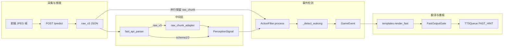

# 相对 merge-all 分支的改动说明

基准分支：`origin/merge-all`（HEAD `cafeeaf` UI overhaul）

本分支：`fast-vocab-and-combos`

---

## 1. 新增：游戏专属快路径词表（Game Vocab）

**文件：** `backend/fast/game_vocab.py`（新文件）

引入 `GameVocab` dataclass 和 `get_vocab(game_id)` 注册表，将快系统 TTS 文案从 `templates.py` 硬编码中抽离，按游戏切换词表。

每个 `GameVocab` 包含：

| 字段 | 用途 |
|---|---|
| `templates` | 4 个意图事件（闪避/攻击窗口/持续危险/走位）× 有/无方向，共 8 个 lambda |
| `button_to_text` | 单键按下 → TTS 文本（`BUTTON_PRESS` 事件） |
| `combo_to_text` | 两键组合 → TTS 文本（组合优先于单键） |
| `fallback` | 无模板时的兜底文本 |

已注册 5 个词表：

| game_id | 游戏 | 说明 |
|---|---|---|
| `_general` | 通用兜底 | 未注册 game_id 时使用 |
| `street_fighter_6` | 街头霸王 6 | 口语化按键/模板（戳一下、搓连段、往左挡等） |
| `black_myth_wukong` | 黑神话：悟空 | 完整 Xbox 按键映射 + 8 条法术/道具组合 |
| `new_super_mario_bros` | 新超级马里奥兄弟 | Wii/DS 按键映射（起跳、出招、旋转跳跃等） |
| `forza_horizon_5` | 极限竞速：地平线 5 | 驾驶操作（刹车、踩油门、转向等） |

---

## 2. 新增：按键边沿检测 + BUTTON_PRESS 事件

**文件：** `backend/fast/event.py`、`backend/fast/action_filter.py`

- 新增 `EventType.BUTTON_PRESS` 和 `GameEvent.button_name` 字段
- `ActionFilter._detect()` 末尾增加按键边沿检测（意图类事件优先，按键作兜底）
- 从 `pressed_buttons`（如 `["SOUTH(0.90)", "WEST(0.72)"]`）提取 conf ≥ 0.5 的按键名
- 冷却 1.2s，同帧多键新按时选置信度最高的

---

## 3. 新增：组合键识别（悟空法术/道具）

**文件：** `backend/fast/templates.py`

- 新增 `_parse_pressed()` / `_find_combo()` helper
- `render_fast()` 的 `BUTTON_PRESS` 分支优先级：**组合键 → 单键 → 空串**
- 组合 key 规则：两键名按字母序用 `+` 拼接（如 `RIGHT_TRIGGER+WEST`）

悟空 8 条组合：

| 组合 | 播报 |
|---|---|
| RT + X | 给我定！ |
| RT + Y | 聚形散气！ |
| RT + B | 广智救我！ |
| RT + A | 上吧孩儿们！ |
| LT + ↑ | 驱邪散！ |
| LT + ← | 避雷散！ |
| LT + → | 虎伏丹！ |
| LT + ↓ | 人参丸！ |

---

## 4. 重构：templates.py 代理到 game_vocab

**文件：** `backend/fast/templates.py`

- 删除原 SF6 硬编码文本，改为 `get_vocab(game_id)` 查表
- `render_fast(event, game_id)` 新增 `game_id` 参数
- 纯模板引擎，延迟 < 1ms，不调用 LLM

---

## 5. 集成：GameSession 携带 game_id

**文件：** `backend/main.py`

- `GameSession` 新增 `current_game_id` 字段（原 `current_game` 保留显示名）
- WebSocket `set_game` 消息读取 `game_id` 参数
- `render_fast(event, self.current_game_id)` 传入当前游戏
- **修复：** 空文本不再 `return` 整个 `_handle_event`，仅跳过 TTS，慢路径（VLM）继续触发
- **诊断日志：** `[模型原始]` / `[翻译]` / `[快提示]` 同时写 stdout 和 `session.log`

---

## 6. 前端：51 个游戏配 {id, label}，发送 game_id

**文件：** `frontend/app.js`

- `GAME_LIST` 从字符串数组改为 `{ id, label }` 对象数组（51 个游戏）
- 4 个目标游戏有专属词表，其余 47 个走 GENERAL 兜底
- `ws.onopen` 时立即发送当前选中游戏的 `game_id`，确保后端同步
- 切换游戏下拉框时发送 `{ type: "set_game", game, game_id }`

---

## 7. 新增：NitroGen 原始响应落盘

**文件：** `backend/nitrogen/fast_api_client.py`、`backend/nitrogen/factory.py`、`backend/config.py`

- 新增环境变量 `NITROGEN_DUMP_PATH`（落盘路径）和 `NITROGEN_DUMP_PRETTY`（是否缩进 JSON）
- 每次 `/predict` 响应追加写入 JSONL 文件，供离线分析
- `start()` / `stop()` 管理文件句柄

---

## 8. 调优：冷却与阈值

**文件：** `backend/config.py`、`backend/fast/action_filter.py`

| 参数 | 旧值 | 新值 | 原因 |
|---|---|---|---|
| `movement_shift` 冷却 | 3s | 15s | 减少「往后走位」频繁播报 |
| `move_magnitude` 阈值 | 0.5 | 0.7 | 过滤摇杆轻微抖动误触发 |

---

## 9. 新增工具脚本

| 文件 | 用途 |
|---|---|
| `tools/analyze_wukong_log.py` | 离线分析 `session.log` 中的按键/intent/播报统计 |
| `tools/dump_wukong_viewer.py` | 读取 NitroGen dump JSONL，输出摇杆/扳机/按键分布 |

---

## 10. 新增冒烟测试

**文件：** `smoke_test_vocab.py`

37 个检查，覆盖词表查找、按键播报、方向模板、ActionFilter 边沿检测、悟空组合键。运行：

```powershell
python smoke_test_vocab.py
```

---

## 不变部分

- 慢系统（VLM）逻辑、TTS/ASR 引擎、NitroGen 连接方式
- 事件检测的意图类规则（SUDDEN_DODGE / ATTACK_WINDOW 等）
- 前端 UI 布局、WebSocket 协议（除 `set_game` 新增 `game_id` 字段外）

---

## 使用方式

### 切换游戏词表

前端下拉框选游戏即可；后端自动按 `game_id` 切换词表。连接 WebSocket 后会立即同步当前选中游戏。

### 启用 NitroGen 原始数据落盘

在 `.env` 中设置：

```
NITROGEN_DUMP_PATH=wukong_actions.jsonl
NITROGEN_DUMP_PRETTY=0
```

重启后端，播放视频后可用 `tools/dump_wukong_viewer.py` 分析。

### 跑冒烟测试

```powershell
python smoke_test_vocab.py
```

---

## 已知限制

- **序列组合未做：** A→X 跳跃轻攻击、X 连按、长按 Y 蓄力等需要历史帧追踪，本轮未实现
- **其他 36 个游戏走 GENERAL：** 仅 SF6 / Wukong / Mario / Forza 有专属词表，其余使用通用兜底
- **RB+左摇杆=奔跑：** 摇杆方向不是按键边沿，归 MOVEMENT_SHIFT 处理，本轮未单独映射

---

## v2 增量（相对 fast-vocab-and-combos @6a846fc）

> 记录时间：2026-06-27  
> 基准：上一版 `fast-vocab-and-combos`（commit `6a846fc`，游戏词表 + 按键边沿 + 组合键 + Nitrogen dump）  
> 目标：在**不改动慢系统 VLM 播报逻辑**的前提下，打通 Nitrogen raw chunk 中间层，并提升黑猴 P0 法术快 TTS 精准度。

---

### v2.1 Nitrogen 模型输出 → 快系统 TTS 完整数据流

远端 NitroGen（`action_fast_system`）每帧 `POST /predict` 返回 **schema (3) raw_v3 JSON**：

```json
{
  "j_left":  [[16, 2], ...],
  "j_right": [[16, 2], ...],
  "buttons": [[16, 21], ...],
  "button_tokens": ["BACK", "DPAD_DOWN", ..., "WEST"]
}
```

`buttons` 为 16 步子帧 × 21 个按键的 float 置信度；模型有约 200ms 推理延迟，**chunk[0:6] 为过去时**，有效信号在 **chunk[6:16]**。



| 层 | 文件 | 逻辑 |
|----|------|------|
| **1. 模型输出** | 远端 `action_fast_system` `/predict` | 每帧 16 步 action chunk：`buttons[16,21]` + `button_tokens[21]` + 摇杆 |
| **2. 解析路由** | `backend/nitrogen/fast_api_parser.py` | `is_raw_v3()` → 走 adapter；否则解析 schema1/2 聚合字段 |
| **3. Raw 中间层** | `backend/nitrogen/raw_chunk_adapter.py` | 跳过 chunk[0:6]，对 chunk[6:16] 做 mean 聚合 → `pressed_buttons` + 意图分；`AdapterState` 做帧间 `is_action_change` |
| **4. 双路输入** | `fast_api_client.py` + `main.py` | `on_signal(signal, video_time, raw_chunk)` — **聚合信号**用于边沿检测，**原始 JSON** 用于子帧 timeline |
| **5. 黑猴检测编排** | `action_filter.py` `_detect_wukong` | ①边沿法术 ②timeline 边沿补充 ③RT 记忆尾步补检 ④P1/P2 单键 ⑤`_detect_wukong_slow`（未改） |
| **6. 子帧扫描** | `wukong_chunk_scan.py` | `extract_timeline` 逐步展开；`scan_wukong_spells` / `scan_wukong_spells_rt_memory`；尾步过滤 + 置信度选优 |
| **7. 翻译层** | `templates.py` + `game_vocab.py` | `render_fast(event, game_id)` → `combo_to_text` / `button_to_text` / 意图模板；`WukongSpeakPolicy` 分级白名单 |
| **8. 输出门控** | `output_gate.py` | P0 法术 > P1 按键 > P2 意图 > P3 走位；重复文本/方向抑制 |
| **9. TTS** | `main.py` `_handle_event` | `trigger_fast` → gate → `tts_queue.push`；**空快文本不阻断** `trigger_slow` VLM |

**关键代码路径：**

```
FastApiNitroGenClient._predict_frame()
  → parse_predict_response(data)           # 聚合 → PerceptionSignal
  → on_signal(signal, video_time, raw_chunk=data)   # raw_v3 时保留原始 JSON
  → GameSession._process_nitrogen_signal()
  → ActionFilter.process(..., raw_chunk=raw_chunk)
  → render_fast(event, game_id)
  → FastOutputGate.should_speak()
  → TTSQueue.push(text, priority=FAST_HINT)
```

---

### v2.2 新增：Nitrogen raw_v3 中间层

| 文件 | 说明 |
|------|------|
| `backend/nitrogen/raw_chunk_adapter.py` | **新文件**。`raw_chunk_to_signal()`：chunk 后半段 mean 聚合、`AdapterState` 帧间突变检测 |
| `backend/nitrogen/fast_api_parser.py` | 扩展：`is_raw_v3()` 时路由到 adapter |
| `backend/nitrogen/fast_api_client.py` | `on_signal` 回调增加第三参 `raw_chunk`；raw_v3 时传入完整 JSON |
| `backend/main.py` | `_process_nitrogen_signal(..., raw_chunk)` 传入 `ActionFilter.process` |

---

### v2.3 新增：黑猴 chunk 子帧法术精准化

| 文件 | 说明 |
|------|------|
| `backend/fast/wukong_chunk_scan.py` | **新文件**。子帧 timeline 展开、跨步/同帧 combo 扫描、尾步窗口、RT 记忆补检、按 face 置信度选优 |
| `backend/fast/action_filter.py` | 黑猴专用 `_detect_wukong` 五段编排；修饰键记忆；spell dedup 不降级 tier3；独立快间隔键 `wukong_lb`(2.0s) / `wukong_t3:{btn}`(0.4s)；tier 按钮独立冷却键 |
| `backend/fast/game_vocab.py` | 新增 `WukongSpeakPolicy`（P0 法术 / P1 LB 回血 / P2 单键 / MUTE 永不播） |
| `backend/config.py` | 新增 `wukong_rt_modifier_window_sec: float = 1.0`（RT 修饰键跨帧记忆加长） |

**`_detect_wukong` 检测顺序（仅快通道前半段，慢检测不变）：**

1. 边沿法术（`_detect_wukong_spell_press` + 同帧双新 defer）
2. timeline 边沿补充（`filter_spell_hits_for_new_buttons` + 置信度选优）
3. timeline RT 记忆补检（`scan_wukong_spells_rt_memory`，仅 `rt_active` 时，尾步 face ≥ 0.25）
4. tier 单键（LB / 疾跑 / 立棍等 P1/P2）
5. `_detect_wukong_slow`（反击窗 / 持续危险 / 战斗结束，**逻辑未改**）

---

### v2.4 新增：快系统优先级与输出门控

| 文件 | 说明 |
|------|------|
| `backend/fast/priority.py` | **新文件**。`FastPriority`：SPELL(0) > BUTTON(1) > INTENT(2) > DIRECTION(3) |
| `backend/fast/output_gate.py` | **新文件**。`FastOutputGate`：P0–P3 冷却、重复文本抑制、黑猴/Forza 专项规则 |
| `backend/fast/event.py` | 扩展 `GameEvent.fast_priority`、`combo_keys` 字段 |

---

### v2.5 修复：慢系统不被快通道阻断

**文件：** `backend/main.py` `_handle_event`

- v1 已修复「空文本 early return」；v2 进一步确保 **gate 拦截快 TTS 时，VLM 慢路径仍正常 `submit`**
- `_detect_wukong_slow`、VLMRequestManager、慢 TTS 优先级：**零改动**

---

### v2.6 配置、工具与测试

| 文件 | 说明 |
|------|------|
| `backend/config.py` | `wukong_rt_modifier_window_sec`；SSH 密码默认改为空串（请用 `.env` 配置） |
| `tools/validate_gt_spells.py` | 扩展 `--timeline`、`--subsample-fps 8` 离线 GT 回归 |
| `tools/replay_raw_dump.py` | raw dump 回放辅助 |
| `tests/test_wukong_chunk_scan.py` | chunk timeline、RT 记忆、dedup、LB/tier3 间隔 |
| `tests/test_handle_event_slow.py` | 慢系统非回归（VLM 不被快 gate 阻断） |
| `tests/test_raw_chunk_adapter.py` | raw_v3 中间层单元测试 |
| `tests/test_action_filter_spell.py` 等 | 法术边沿、combo 集成测试 |

**GT 回归结果（timeline 模式，样本 1415 帧）：**

| 指标 | 结果 |
|------|------|
| 10fps timeline | **6/8** |
| 8fps subsample | **6/8**（= 10fps 100%，高于 80% 目标） |
| pytest（wukong + slow） | **18/18** |

**HIT：** 14s 给我定、51s 疾跑、61s 疾跑、68s 广智、102s 化身、137s 聚形散气  
**MISS（预期）：** 19s 上吧孩儿们（模型无 RT+SOUTH 弱信号）、54s 聚形散气（NORTH@54.7s 超出 ±0.5s GT 窗口）

---

### v2.7 文件对比（v1 @6a846fc vs v2）

| 文件 | v1 | v2 |
|------|----|----|
| `backend/nitrogen/raw_chunk_adapter.py` | 无 | **新增** |
| `backend/fast/wukong_chunk_scan.py` | 无 | **新增** |
| `backend/fast/output_gate.py` | 无 | **新增** |
| `backend/fast/priority.py` | 无 | **新增** |
| `backend/fast/action_filter.py` | ~13KB 基础边沿 | 黑猴专用路径 + chunk 编排 |
| `backend/fast/game_vocab.py` | 词表 + combo | + `WukongSpeakPolicy` |
| `backend/main.py` | game_id + 日志 | + `raw_chunk` 传递 + slow unblock |
| `tools/validate_gt_spells.py` | 无/旧 | timeline 离线回归 |

---

### v2.8 明确未改动

- 远端 `action_fast_system/` NitroGen 模型与服务端
- `_detect_wukong_slow` 逻辑
- VLM / TTS 慢优先级、`VLMRequestManager`
- 不为 GT 时间戳硬编码 trigger
- 不恢复黑猴下 `_detect_sudden_dodge` / `_detect_movement_shift` fast 噪声

---

### v2.9 验证命令

```powershell
# 单元测试
python -m pytest tests/test_wukong_chunk_scan.py tests/test_handle_event_slow.py -v

# GT 离线回归（需样本帧目录）
python tools/validate_gt_spells.py <frames_dir> --timeline
python tools/validate_gt_spells.py <frames_dir> --timeline --subsample-fps 8
```
